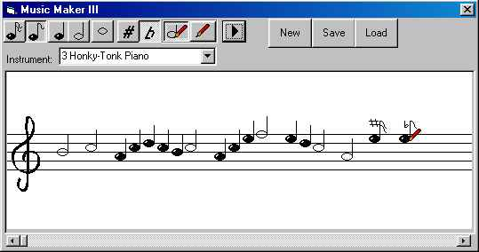



## Music Maker III \(Compose real music\)

### Description

Compose real music with your computer.

The powerful library installed with windows gives you the ability of reproducing hunderts of musical instruments!

This is a revised version with some bug fixes.

Try out some samples inluded with the program.
 
### More Info
 

             |
---                |---
**Submitted On**   |2003-04-03 11:23:00
**By**             |[Lefteris Eleftheriades](https://github.com/Planet-Source-Code/PSCIndex/blob/master/ByAuthor/lefteris-eleftheriades.md)
**Level**          |Advanced
**User Rating**    |4.9 (69 globes from 14 users)
**Compatibility**  |VB 6\.0
**Category**       |[Sound/MP3](https://github.com/Planet-Source-Code/PSCIndex/blob/master/ByCategory/sound-mp3__1-45.md)
**World**          |[Visual Basic](https://github.com/Planet-Source-Code/PSCIndex/blob/master/ByWorld/visual-basic.md)
**Archive File**   |[Music\_Make156843432003\.zip](https://github.com/Planet-Source-Code/lefteris-eleftheriades-music-maker-iii-compose-real-music__1-44465/archive/master.zip)

